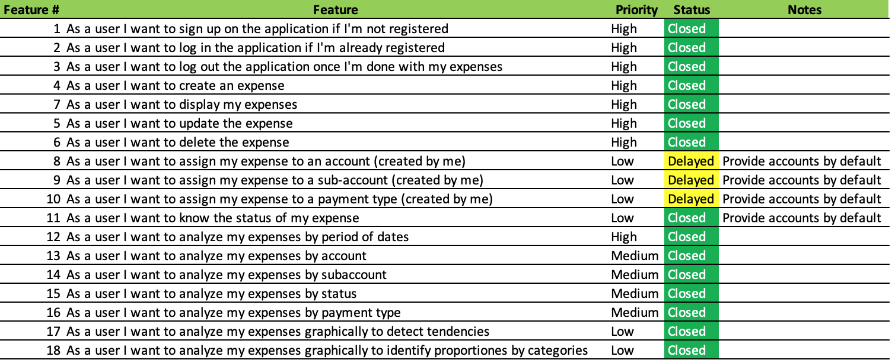
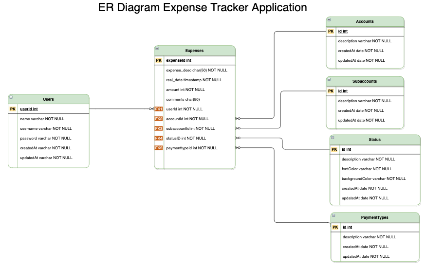
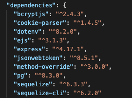

# _Control-Xpense_ - The Expense Controller

Developer: Cesar Trevino  
Learning goal: Develop an full-stack application with the following features

1. Password protected
1. Incorporate authentication capabilities
1. Data persistence with PostgreSQL & Sequelize
1. Heroku production deployment
1. Implementation of REST-ful routes

Application goal: The application has been developed to provide a basic family expense management by assigning every specific expense to categories and statuses permiting further analysis.

### The MVP definition

---

#### User stories

#### Entity Relationship Diagram

#### Wireframe

_Home_

This form will welcome the user to the application for Signing Up, Log In and Log Out
 

 

_Display Expenses_

This form permits the user to see all the expenses. Because the number of expenses can be huge a filter section has been developed so a user can filter and analyze the expenses by:

- Range of dates
- Account
- Subaccount
- Type of payment
- Status

User can edit and delete expenses with in this form

 

_Create an Expense_

User will create expenses using this form. By default it only displays the last 10 expenses in the grid as a manner of reference. User can edit and delete expenses with in this form.

 

_Edit an Expense_

User can edit an expense either when displaying expenses or creating a new expense. It allows you to modify any of the expense information. Once the edit information is submitted the application will return to the form that trigger the update action.

 

_Delete an Expense_

User can delete an expense either when displaying expenses or creating a new expense. It allows you to delete any expense with a simple clic.

 

_Graph Expenses_

With the use of pie and line graphs the user can utilize this form to analyze expenses in a general way to detect tendencies and proportions.

 

_Other forms_

Application will have also forms to manage users and access:

- Sign Up: Form to create a new user by entering name, username and password
- Log In: Form to sign an existing user in the application
- Edit profile: Form to edit user name, username and password

### The MVP solution

---

#### MVC application file structure

_Folders_

- Application folder: Root folder for the application
- config: Contains the config.json file
- controllers: Controller files for users, authentication and expenses
- migrations: Sequelize files to create and drop database tables
- models: Sequelize files to define models
- node_modules: Modules required by the application
- public: css file
- seeders: Files to seed tables initially
- views: Application HTML files

_Associations_

#### Model associations

#### Table associations

_REST-ful routes_

##### Users

##### Expenses

_Views_

### Main Challenges

---

_Dinamyc query configuration_

Including the filter section for expense analysis in different parts of the application required the query should be created dinamically based on the input provided by the user in the filter section. The nature of this changing criteria made the utilization of Sequelize complicated when implementing complex where clauses. The solution to this was to create a raw query string based on the user selections and execute this string with a command like this,

> const filteredExpenses = await sequelize.query(_*query*_, {
> type: QueryTypes.SELECT,
> });

Where the query parameter is the SQL string.

_Integration with Google Charts_

Google Charts is a good library of Graphs to visualize data in a website. The most common way to use Google Charts is with simple JavaScript that the developer embed in the web page. The input for the object is a simple table represented as an array. For some reason <%=variable%> notation is not accepted inside of the script embeded in the web page. I found out that if the variable is assigned this way

> data = "<%=variable%>"

inside of the script the variable is assigned to data as a string with elements separated by commas. Then I have to rebuild the array and send this new array as parameter for graph.

### User Requirements

---

- Web browser
- Internet connectivity

### Technologies & Tools

---

- Wireframing & Entity Relationship Diagram
  - Designing of the trivia UI. [(diagrams.net)](https://app.diagrams.net)
- Developer tools
  - Command line: It enables the computer interaction
  - Visual Studio Code: For coding HTML, css and javascript
  - Google Chrome Developer tools: For troubleshooting and debugging
  - Google Chrome Browser: For displaying the application
- Code versioning and control tools
  - Git: Local tool running on my computer to keep control of application changes
  - Git hub: Online integrated tool, [GitHub](https://www.github.com) keeps the application repository
- Database tools
  - PostgreSQL
  - Sequelize
- Additional resources

  - [JSON Web Tokens](https://jwt.io/)
  - [Google charts](https://developers.google.com/chart)
  - [Node.js](https://nodejs.org/en/about/)
  - npm: Node Package Manager installed with [Node.js](https://nodejs.org/en/about/)
  - Packages:

    

- Image tools & sources
  - Source of wallpapers and images: [Include images in the UI](http://getwallpapers.com)
